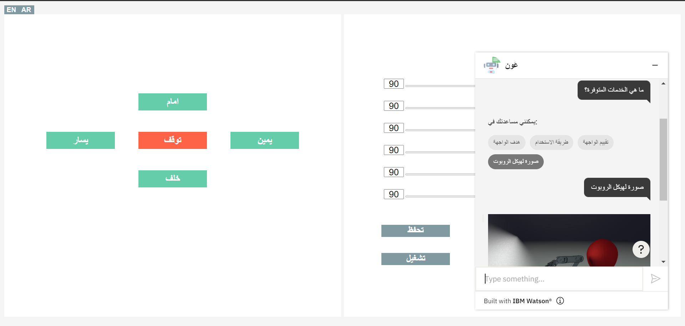

# A-chatbot-for-a-website
A chatbot named (عَون) that acts as a first line defense for a website's customer service. 

## The chatbot components
It consists of one dialog skill named (خدمة مستخدمي واجهة) that includes:
  1. Five intents (Greeting, Service, Image, Rating, Goodbye).
  2. Three entities (Interface_Goal‬, Using_Method‬, sys-percentage).
  3. Twenty-two dialog nodes.

It will start by greeting the user in Arabic. Then, it will detect the text entered by the user to provide the correct response. The chatbot is trained to provide four services; explain the interface purpose, clarify the interface components, rate the services, and display an image of the robot structure.  Additionally, it is trained to greet and goodbye the user.

## Deploy the chatbot 
The chatbot is integrted with a robot arm control interface by embeding this code:
```
<script>
  window.watsonAssistantChatOptions = {
      integrationID: "efa8e356-43bd-4ea6-a952-2ce1ffa30d83", // The ID of this integration.
      region: "us-south", // The region your integration is hosted in.
      serviceInstanceID: "bbf1579c-316e-46ed-9ae3-4d8a2ebe091e", // The ID of your service instance.
      onLoad: function(instance) { instance.render(); }
    };
  setTimeout(function(){
    const t=document.createElement('script');
    t.src="https://web-chat.global.assistant.watson.appdomain.cloud/loadWatsonAssistantChat.js";
    document.head.appendChild(t);
  });
</script>
```
This image shows the chatbot style on the interface:



